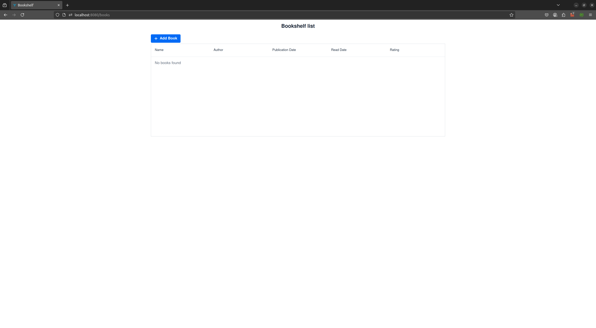
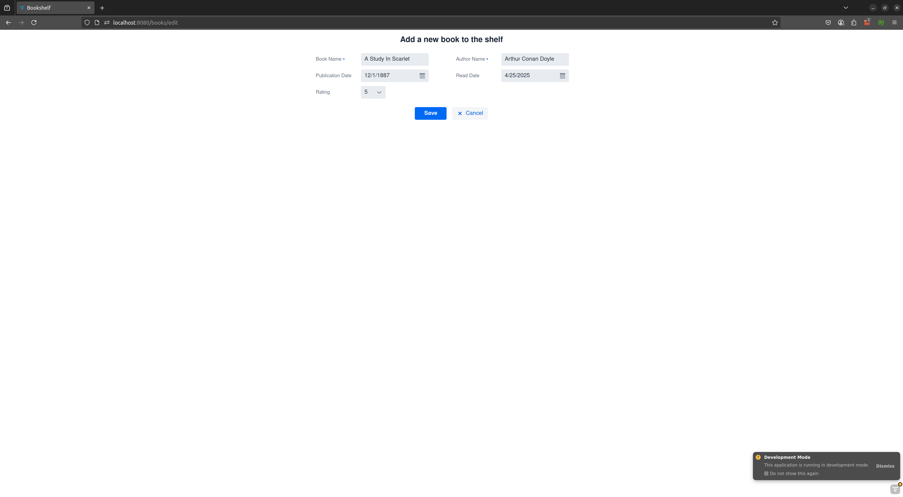
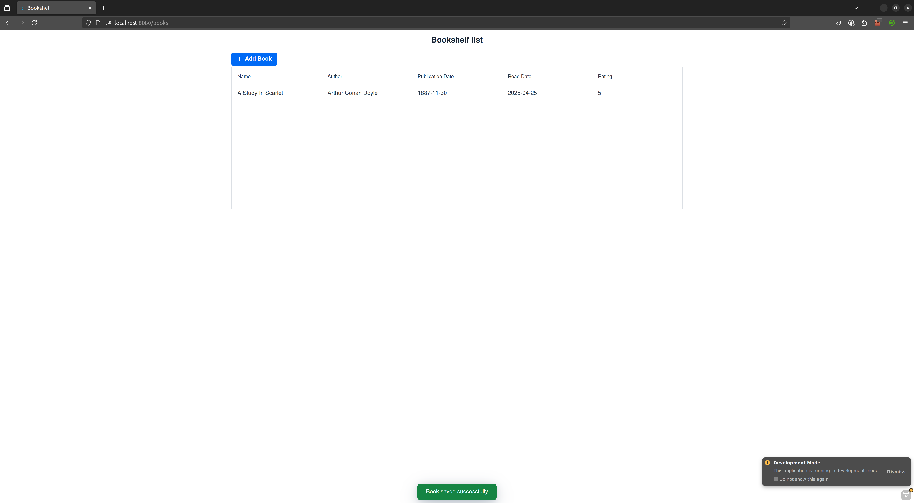
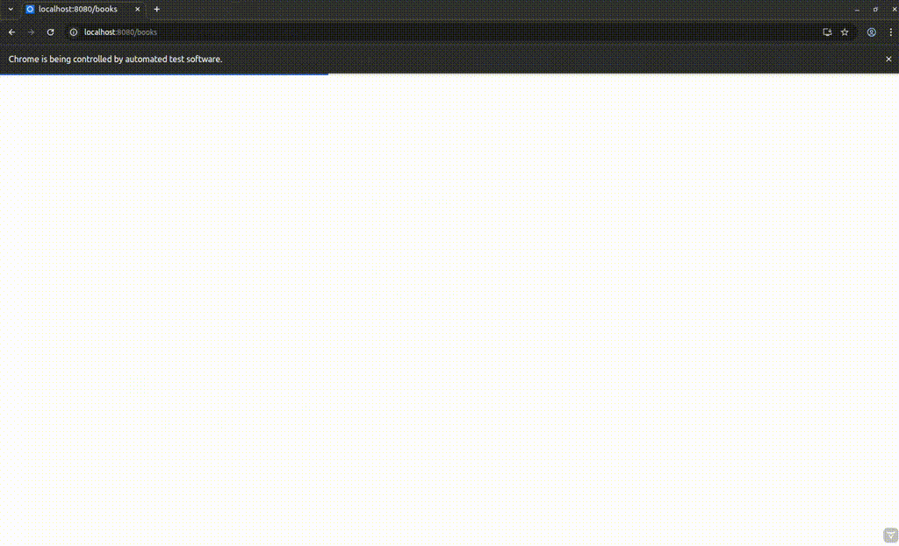

# Bookshelf

A Vaadin + SpringBoot + in-memory H2 DB + Selenium tested application to keep track of books read by a user.

## How to deploy

> mvn spring-boot:run

The application main view is available at http://localhost:8080/books.

1. The application contains the list of read books (initially none):

2. Once added with valid fields (form is validated):

3. It is saved in the in-memory H2 DB and it visible in the read books list

**By double-clicking a row, you can edit it** in the form.

# Running the UI tests

This project includes Selenium tests. This is my first dab at UI tests. What I liked about this is because seeing the
automation interacting with the app looks cool. Proof below.

I decided not to go with [Vaadin TestBench](https://vaadin.com/testbench) because it is a pro license tool. I have the
license now, but I might not have it in the future ¯\_(ツ)_/¯

